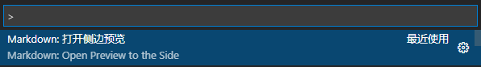

# Markdown基本使用 <!-- {docsify-ignore-all} -->

## 编辑器

推荐使用**VSCode**编辑器来编写文档。在VScode命令面板输入 `Markdown: Open Preview to the Side` 命令并执行,可以在右侧面板实现文档的实时预览。



## 标题

需要创建标题则可以在标题内容前添加井号 （`#`）和一个空格。`#`的数量代表了标题的级别。

|  Markdown语法             | HTML                       |   展示效果                |
|  ----                     | ----                       | ----                     |
| `# Heading level 1`       | `<h1>Heading level 1</h1>` | <h1>Heading level 1</h1> | 
| `## Heading level 2`      | `<h2>Heading level 2</h2>` | <h2>Heading level 2</h2> |
| `### Heading level 3`     | `<h3>Heading level 3</h3>` | <h3>Heading level 3</h3> |
| `#### Heading level 4`    | `<h4>Heading level 4</h4>` | <h4>Heading level 4</h4> |
| `##### Heading level 5`   | `<h5>Heading level 5</h5>` | <h5>Heading level 5</h5> | 
| `###### Heading level 6`  | `<h6>Heading level 6</h6>` | <h6>Heading level 6</h6> |

## 段落格式

Markdown段落没有特殊的格式，直接编写文字即可。需要段落换行可以使用`两个空格加上回车`。需要重起一个段落可以使用`空行`来分隔新旧段落。
```
这是第一段的第一行，在该行末尾添加两个空格再回车就可以开启第二行  
这是第二行，在后面添加空行就可以开启第二段

这是第二段
```

## 列表

Markdown支持有序列表和无序列表。

无序列表使用星号、加号或者减号作为列表标记，这些标记后面需要添加一个空格，然后再填写内容。

```
* 第一项  
* 第二项
* 第三项

+ 第一项
+ 第二项
+ 第三项 


- 第一项 
- 第二项 
- 第三项
```

效果如下：

* 第一项  
* 第二项
* 第三项

+ 第一项
+ 第二项
+ 第三项 

- 第一项 
- 第二项 
- 第三项

有序列表使用数字加上 `.` 号来表示，例如：  

```
1. 第一项
2. 第二项
3. 第三项
```

效果如下：

1. 第一项
2. 第二项
3. 第三项

### 列表嵌套  

列表嵌套只需要在子列表中的选项前面添加四个空格即可：

```
1. 第一项  
    - 第一项嵌套的第一个元素
    - 第一项嵌套的第二个元素
2. 第二项
    - 第二项嵌套的第一个元素
    - 第二项嵌套的第二个元素
```

效果如下：  

1. 第一项  
    - 第一项嵌套的第一个元素
    - 第一项嵌套的第二个元素
2. 第二项
    - 第二项嵌套的第一个元素
    - 第二项嵌套的第二个元素


## 强调

可以将文本设置为斜体或者粗体来强调内容的重要性。

### 斜体

要用斜体显示文本，请在单词或短语前后添加一个星号(*):

```
给*单词*或者*短语*加上斜体
```

效果如下：

给*单词*或者*短语*加上斜体

### 粗体

要加粗显示文本，请在单词或短语前后添加两个星号(**):

```
给**单词**或者**短语**加粗
```
效果如下：

给**单词**或者**短语**加粗

## 分隔线

要创建分隔线，需要单独一行上使用三个或多个星号 (***)、破折号 (---) 或下划线 (___) ，并且不能包含其他内容。

```
***
---
___
```

效果如下：

***
---
___

## 区块

区块引用是在段落开头使用 `>` 以及一个空格符号： 

```
> 区块引用
```

效果如下：

> 区块引用

### 多个段落的块引用

块引用可以包含多个段落，需要在不同段落之间的空白行添加 `>` 符号：

```
> 这是第一段内容
>
> 这是第二段内容
```

效果如下：

> 这是第一段内容
>
> 这是第二段内容

### 嵌套块引用  

区块也是可以嵌套的，一个 `>` 是一层，两个 `>` 是第一层嵌套，以此类推：
 
```
> 最外层
>> 第一层嵌套
>>> 第二层嵌套
```

效果如下：
> 最外层
>> 第一层嵌套
>>> 第二层嵌套

### 带有其他元素的块引用

在块引用中可以包含其他其他 Markdown 格式的元素。并非所有元素都可以使用，你需要进行实验以查看哪些元素有效。比较常用的有：

```
> #### The quarterly results look great!
>
> - Revenue was off the chart.
> - Profits were higher than ever.
>
>  *Everything* is going according to **plan**.
```

效果如下：  
> #### The quarterly results look great!
>
> - Revenue was off the chart.
> - Profits were higher than ever.
>
>  *Everything* is going according to **plan**.


## 代码

要将单词或者短语表示为代码，需要将其包裹在反引号中（`）：

```
将这句话的 `word` 表示为代码
```

效果如下：  

将这句话的 `word` 表示为代码

### 转义反引号

如果需要表示为代码的单词或者短语中以及包含了一个或者多个反引号，则可以通过将单词或短语包裹在双反引号当中（``）。

```
``Use `code` in your Markdown file.``
```

效果如下：

``Use `code` in your Markdown file.``

### 代码块

要创建代码块，需要将代码块的每一行缩进至少四个空格或一个制表符。

`<html>`  
&nbsp;&nbsp;&nbsp;&nbsp;`<head>`  
&nbsp;&nbsp;&nbsp;&nbsp;`</head>`  
`</html>`  

如果想创建不需要缩进的代码块，需要使用围栏式代码块，即在代码块之前和之后的行上使用三个反引号（```）：

\`\`\`  
{  
  "firstName": "John",  
  "lastName": "Smith",  
  "age": 25  
}  
\`\`\`

效果如下：
```
{
  "firstName": "John",
  "lastName": "Smith",
  "age": 25
}
```

### 语法高亮

通过我们希望代码块可以根据语言对应的语法高亮显示，此时我们需要在代码块之前的反引号旁边指定一种语言：

\`\`\` json

{  
  "firstName": "John",  
  "lastName": "Smith",  
  "age": 25  
}  
\`\`\`

效果如下：

```json
{
  "firstName": "John",
  "lastName": "Smith",
  "age": 25
}
```


## 链接

链接文本放在中括号中，链接地址放在后面的小括号中，链接title是当鼠标悬停在链接上时会出现的文字，这个title是可选的，它放在圆括号中链接地址后面，跟链接地址之间以空格分隔。

```
[超链接显示名](超链接地址 "超链接title")
```

效果如下： 

[超链接显示名](超链接地址 "超链接title")  

### 网址和Email地址

使用尖括号可以很方便地把URL或者email地址变成可点击的链接。

```
<https://markdown.com.cn>  
<fake@example.com>  
```

效果如下：  

<https://markdown.com.cn>  
<fake@example.com>

## 图片、动图和视频

### 图片或动图

要添加图像或者动图，请使用感叹号 (!), 然后在方括号增加替代文本，图片或动图链接放在圆括号里，括号里的链接后可以增加一个可选的标题文本：

```
  
```

效果如下：

  

### 视频

如果需要添加视频在文档中，那么可以使用HTML的video标签或者iframe标签  

```html
<!-- mp4格式 -->
<video id="video" controls="" preload="none" poster="封面">
      <source id="mp4" src="视频地址.mp4" type="video/mp4">
</video>

<!-- webm格式 -->
<video id="video" controls="" preload="none" poster="封面">
      <source id="webm" src="视频地址.webm" type="video/webm">
</video>

<!-- ovg格式 -->
<video id="video" controls="" preload="none" poster="封面">
      <source id="ogv" src="视频地址.ogv" type="video/ogv">
</video>
```

``` html
<iframe 
src="视频地址.mp4" 
scrolling="no" 
frameborder="no" 
framespacing="0" 
allowfullscreen="true" 
height=600 
width=800> 
</iframe>
```

## 表格

要添加表格，则需要使用三个或者多个连字符（---）创建每列的标题，并使用管道（|）分隔每列。

```
| 表头   | 表头  |
|  ---   | ---  |
| 单元格 | 单元格 |
| 单元格 | 单元格 |
```

效果如下：

| 表头   | 表头  |
|  ---   | ---  |
| 单元格 | 单元格 |
| 单元格 | 单元格 |

可以通过在标题行中的连字符的左侧，右侧或两侧添加冒号（:），将列中的文本对齐到左侧，右侧或中心。

```
|    居左   |     居中   |    居右   |
|   :---    |   :---:   |   ---:    |
| 单元格内容 | 单元格内容 | 单元格内容 |
```

效果如下：

|    居左   |     居中   |    居右   |
|   :---    |   :---:   |   ---:    |
| 单元格内容 | 单元格内容 | 单元格内容 |


## 转义字符

要显示原本用于格式化 Markdown 文档的字符，需要在字符前面添加反斜杠字符 \ ：

```
\* Without the backslash, this would be a bullet in an unordered list.
```

效果如下：

\* Without the backslash, this would be a bullet in an unordered list.

## 内嵌HTML标签

对于 Markdown 涵盖范围之外的标签，都可以直接在文件里面用 HTML 本身。如需使用 HTML，不需要额外标注这是 HTML 或是 Markdown，只需 HTML 标签添加到 Markdown 文本中即可。

### 行级内联标签

像`<span>`、`<cite>`、`<del>`这类行级内联标签可以在Markdown的段落、列表或者是标题中任意使用。包括像 HTML 的` <a> `或 ` `标签也可以替代Markdown的链接语法和图片语法，而且使用HTML标签更方便于更改元素的属性。

```
This **word** is bold. This <em>word</em> is italic.
```

效果如下：

This **word** is bold. This <em>word</em> is italic.

### 区块标签

如 `<div>`、`<table>`、`<pre>`、`<p>` 等区块元素标签，必须在前后加上空行，以便于区分。同时这些元素的开始与结束标签，不可以使用tab或者空白来进行缩进。

```
This is a regular paragraph.

<table>
    <tr>
        <td>Foo</td>
    </tr>
</table>

This is another regular paragraph.
```

效果如下：

This is a regular paragraph.

<table>
    <tr>
        <td>Foo</td>
    </tr>
</table>

This is another regular paragraph.

> 在 HTML 块级标签内不能使用 Markdown 语法。例如 `<p>`italic and \*\*bold\*\*`</p>` 将不起作用。
