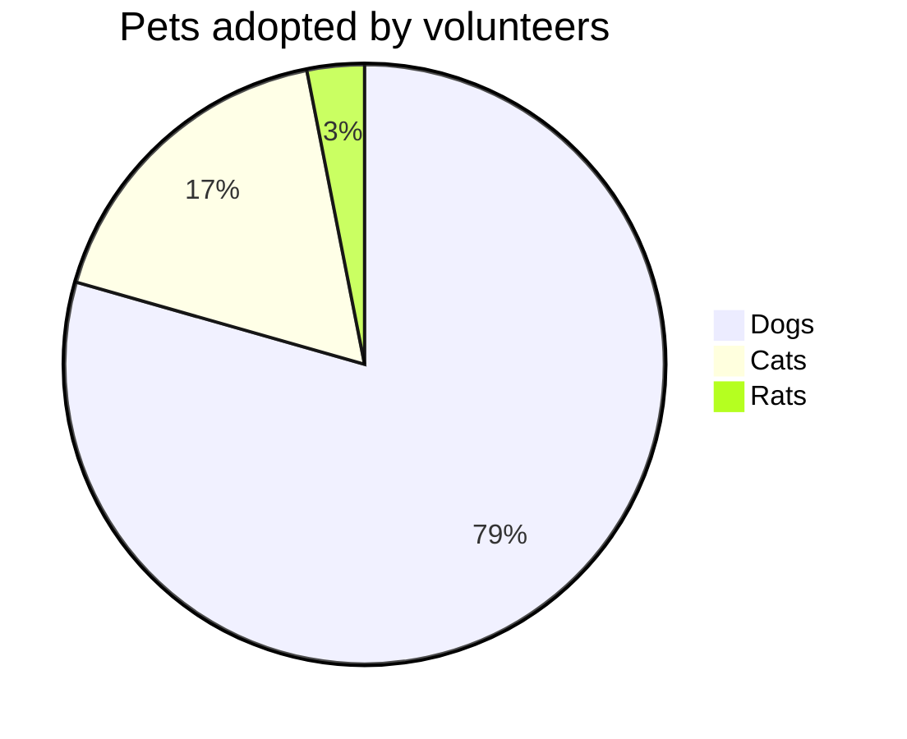

# 更多用法 <!-- {docsify-ignore} -->

<a name="divtop"></a>

## 饼图、柱状图、折线图 <!-- {docsify-ignore} -->

### 饼图 <!-- {docsify-ignore} -->

在制作饼图时用到的关键词

| 关键词   | 功能  |
|  ---   | ---  |
| pie | 定义饼形图 |
| title | 标题 |


<code>
 ```mermaid                                             <br> 
    pie                                               <br> 
&nbsp;&nbsp;&nbsp;&nbsp;title Pets adopted by volunteers<br> 
&nbsp;&nbsp;&nbsp;&nbsp;"Dogs" : 386                    <br> 
&nbsp;&nbsp;&nbsp;&nbsp;"Cats" : 85                     <br> 
&nbsp;&nbsp;&nbsp;&nbsp;"Rats" : 15                     <br> 
  ```
</code>
 


效果如下：



### 柱状图 <!-- {docsify-ignore} -->

*该功能暂未开放，敬请期待...*


### 折线图 <!-- {docsify-ignore} -->

*该功能暂未开放，敬请期待...*


## 锚点 <!-- {docsify-ignore} -->

在编写文档的时候，可能需要用到锚点来进行同篇文章内的位置快速跳转。

我们可以在锚点位置定义 `a标签`， 同时定义标签的 `name` 属性，在需要进行跳转的地方以markdown的链接语法定义链接，链接的小括号内写入 `#name的属性值` 即可。

例如在本文的正文开头定义了一个：`<a name="divtop"></a>`，

```
我们跳转过去：[跳转指定位置](#divtop)
```

效果如下：

我们跳转过去：[跳转到指定位置](#divtop)

在点击`跳转指定位置`后，位置将被重新定位于定义 `a标签`的位置，即实现了锚点跳转。


当目标位置为**标题**时，可以直接在链接地址中使用 `#标题名称`, 例如设置链接跳转到本文的一级标题“更多用法”处：

```
[跳转到锚点：更多用法](#更多用法)
```

效果如下：

[跳转到锚点：更多用法](#更多用法)

> 不论是几级标题，小括号内都是使用一个 # 就可以了。

## 附件 <!-- {docsify-ignore} -->

*该功能暂未开放，敬请期待...*